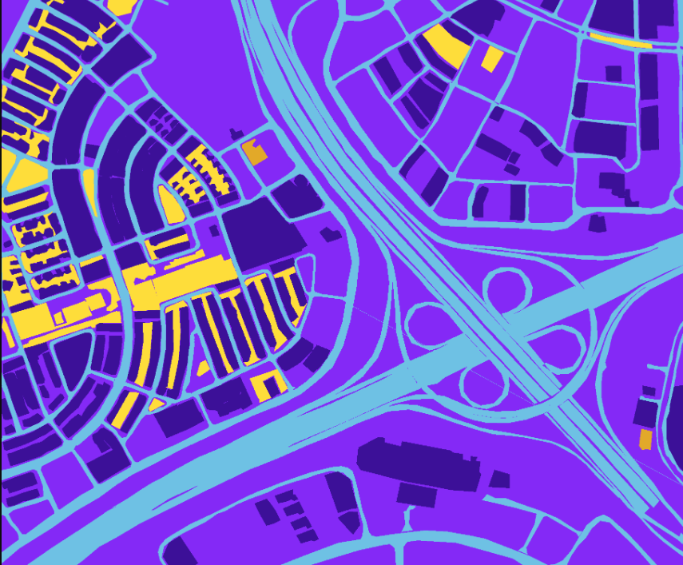

# 🌍 Satellite Image Segmentation using U-Net

This project focuses on segmenting satellite images to detect and analyze land cover features using a U-Net-based deep learning model. Developed as part of an assignment for ISRO Bharatiya Antariksh, the model automates feature extraction from high-resolution satellite imagery.

## 🚀 Project Highlights

- ⚙️ Built using the U-Net architecture for efficient pixel-wise segmentation.
- 🛰️ Designed for satellite imagery with terrain and land classification use cases.
- 📈 Achieved **86% Intersection over Union (IoU)** on validation data.
- 🧠 Trained using a custom dataset of satellite images and corresponding segmentation masks.
- ⏱️ Reduced image processing time drastically through automation.

## 📂 Repository Structure

├── satellite-image-segmentation.ipynb # Main notebook with training + evaluation
├── dataset/ # Folder to store satellite images & masks(limited images)
├── results/ # Sample predictions and IoU metrics
├── README.md # Project documentation


## 🧪 Technologies Used

- Python 3.x
- TensorFlow / Keras
- OpenCV
- NumPy, Matplotlib
- Jupyter Notebook

## 🖼️ Sample Output

Segmentation overlay from satellite image:

| Input Image | Predicted Mask |
|-------------|----------------|
|  |  |

## 🛠️ How to Run

1. Clone the repo:
   ```bash
   git clone https://github.com/yourusername/Satellite_Image_Segmentation.git
   cd Satellite_Image_Segmentation
2.  ```bash
    jupyter notebook satellite-image-segmentation.ipynb

If you use this work, please cite it as:

Vikas Kumar, Satellite Image Segmentation using U-Net, ISRO Bharatiya Antariksh Project, July 2025.

